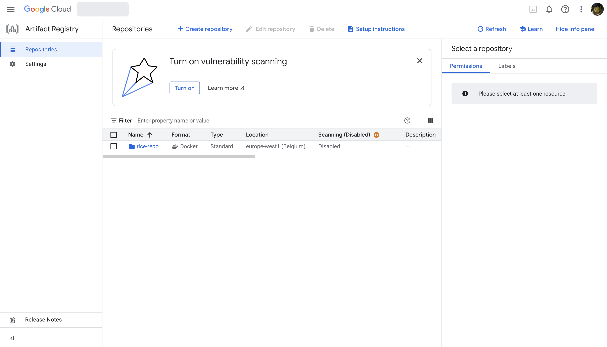
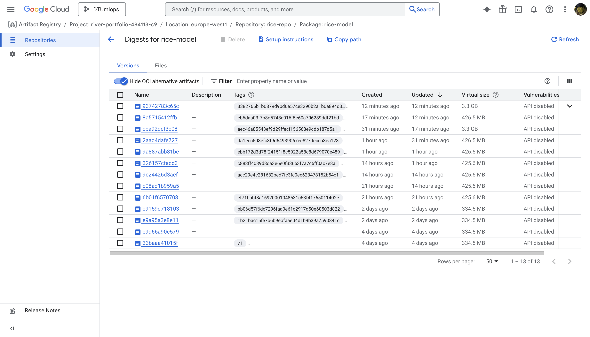
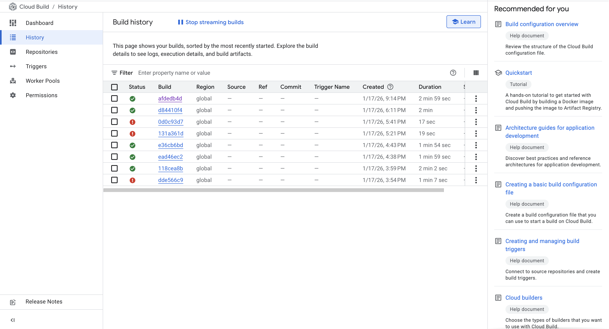
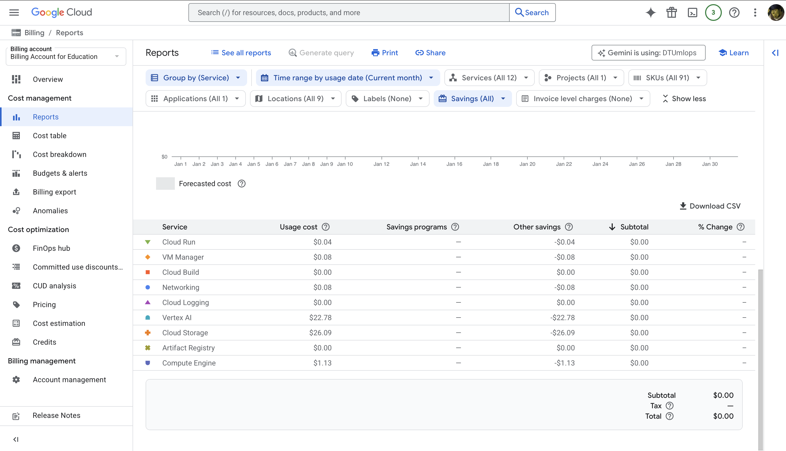
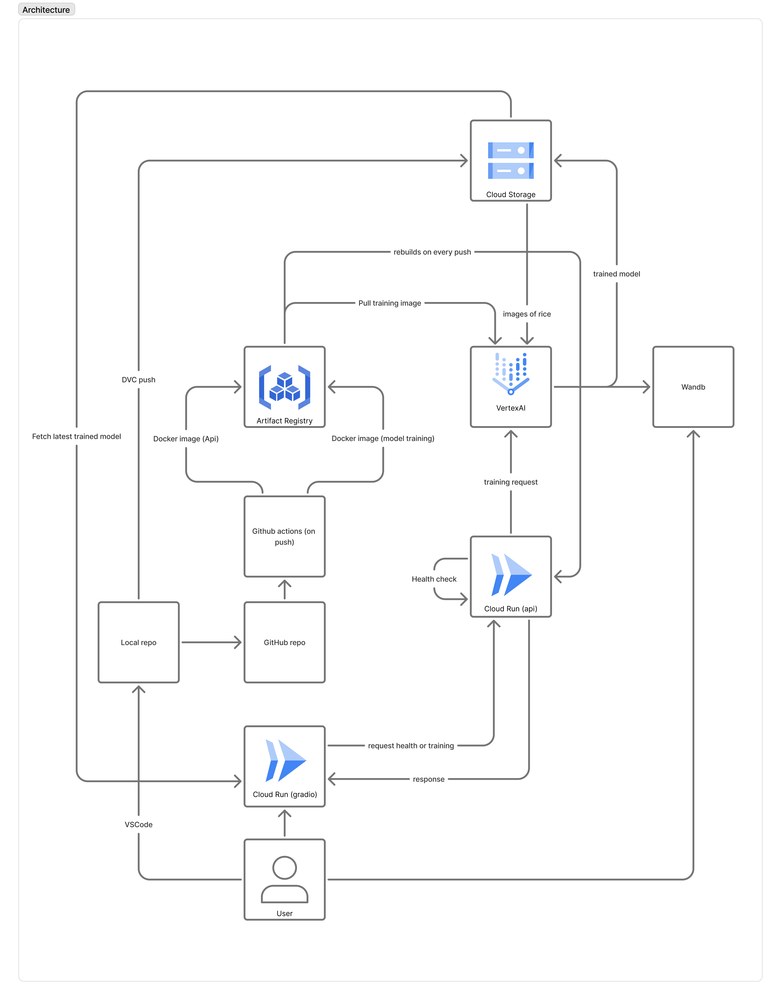

# Exam template for 02476 Machine Learning Operations

This is the report template for the exam. Please only remove the text formatted as with three dashes in front and behind
like:

`--- question 1 fill here ---`

Where you instead should add your answers. Any other changes may have unwanted consequences when your report is
auto-generated at the end of the course. For questions where you are asked to include images, start by adding the image
to the `figures` subfolder (please only use `.png`, `.jpg` or `.jpeg`) and then add the following code in your answer:

``

In addition to this markdown file, we also provide the `report.py` script that provides two utility functions:

Running:

```bash
python report.py html
```

Will generate a `.html` page of your report. After the deadline for answering this template, we will auto-scrape
everything in this `reports` folder and then use this utility to generate a `.html` page that will be your serve
as your final hand-in.

Running

```bash
python report.py check
```

Will check your answers in this template against the constraints listed for each question e.g. is your answer too
short, too long, or have you included an image when asked. For both functions to work you mustn't rename anything.
The script has two dependencies that can be installed with

```bash
pip install typer markdown
```

## Overall project checklist

The checklist is _exhaustive_ which means that it includes everything that you could do on the project included in the
curriculum in this course. Therefore, we do not expect at all that you have checked all boxes at the end of the project.
The parenthesis at the end indicates what module the bullet point is related to. Please be honest in your answers, we
will check the repositories and the code to verify your answers.

### Week 1

- [x] Create a git repository (M5)
- [x] Make sure that all team members have write access to the GitHub repository (M5)
- [x] Create a dedicated environment for you project to keep track of your packages (M2)
- [x] Create the initial file structure using cookiecutter with an appropriate template (M6)
- [x] Fill out the `data.py` file such that it downloads whatever data you need and preprocesses it (if necessary) (M6)
- [x] Add a model to `model.py` and a training procedure to `train.py` and get that running (M6)
- [x] Remember to fill out the `requirements.txt` and `requirements_dev.txt` file with whatever dependencies that you
      are using (M2+M6)
- [x] Remember to comply with good coding practices (`pep8`) while doing the project (M7)
- [x] Do a bit of code typing and remember to document essential parts of your code (M7)
- [x] Setup version control for your data or part of your data (M8)
- [ ] Add command line interfaces and project commands to your code where it makes sense (M9)
- [x] Construct one or multiple docker files for your code (M10)
- [x] Build the docker files locally and make sure they work as intended (M10)
- [ ] Write one or multiple configurations files for your experiments (M11)
- [ ] Used Hydra to load the configurations and manage your hyperparameters (M11)
- [ ] Use profiling to optimize your code (M12)
- [ ] Use logging to log important events in your code (M14)
- [x] Use Weights & Biases to log training progress and other important metrics/artifacts in your code (M14)
- [ ] Consider running a hyperparameter optimization sweep (M14)
- [ ] Use PyTorch-lightning (if applicable) to reduce the amount of boilerplate in your code (M15)

### Week 2

- [x] Write unit tests related to the data part of your code (M16)
- [x] Write unit tests related to model construction and or model training (M16)
- [x] Calculate the code coverage (M16)
- [x] Get some continuous integration running on the GitHub repository (M17)
- [x] Add caching and multi-os/python/pytorch testing to your continuous integration (M17)
- [ ] Add a linting step to your continuous integration (M17)
- [ ] Add pre-commit hooks to your version control setup (M18)
- [ ] Add a continues workflow that triggers when data changes (M19)
- [x] Add a continues workflow that triggers when changes to the model registry is made (M19)
- [x] Create a data storage in GCP Bucket for your data and link this with your data version control setup (M21)
- [x] Create a trigger workflow for automatically building your docker images (M21)
- [x] Get your model training in GCP using either the Engine or Vertex AI (M21)
- [x] Create a FastAPI application that can do inference using your model (M22)
- [x] Deploy your model in GCP using either Functions or Run as the backend (M23)
- [ ] Write API tests for your application and setup continues integration for these (M24)
- [ ] Load test your application (M24)
- [ ] Create a more specialized ML-deployment API using either ONNX or BentoML, or both (M25)
- [x] Create a frontend for your API (M26)

### Week 3

- [ ] Check how robust your model is towards data drifting (M27)
- [ ] Deploy to the cloud a drift detection API (M27)
- [ ] Instrument your API with a couple of system metrics (M28)
- [ ] Setup cloud monitoring of your instrumented application (M28)
- [ ] Create one or more alert systems in GCP to alert you if your app is not behaving correctly (M28)
- [ ] If applicable, optimize the performance of your data loading using distributed data loading (M29)
- [ ] If applicable, optimize the performance of your training pipeline by using distributed training (M30)
- [ ] Play around with quantization, compilation and pruning for you trained models to increase inference speed (M31)

### Extra

- [ ] Write some documentation for your application (M32)
- [ ] Publish the documentation to GitHub Pages (M32)
- [ ] Revisit your initial project description. Did the project turn out as you wanted?
- [ ] Create an architectural diagram over your MLOps pipeline
- [x] Make sure all group members have an understanding about all parts of the project
- [x] Uploaded all your code to GitHub

## Group information

### Question 1

> **Enter the group number you signed up on <learn.inside.dtu.dk>**
>
> Answer:

Group: MLOps 1

### Question 2

> **Enter the study number for each member in the group**
>
> Example:
>
> _sXXXXXX, sXXXXXX, sXXXXXX_
>
> Answer:

s214927, s253843, s195099, s211048, s211917

### Question 3

> **A requirement to the project is that you include a third-party package not covered in the course. What framework**
> **did you choose to work with and did it help you complete the project?**
>
> Recommended answer length: 100-200 words.
>
> Example:
> _We used the third-party framework ... in our project. We used functionality ... and functionality ... from the_
> _package to do ... and ... in our project_.
>
> Answer:

We used scikit-learn, specifically the `sklearn.metrics` module, as our third-party package. It gave us a clean,
well-tested set of evaluation utilities that are not part of the course stack. We relied on `classification_report` and
the standard scorers like `accuracy_score`, `precision_score`, `recall_score`, and `f1_score` to evaluate model
predictions in a consistent way across experiments. This allowed us to compare models using the same metric definitions
and to surface class-imbalance effects instead of relying on accuracy alone. We also used the metrics output as part of
our logging and reporting so the results were easy to communicate and reproduce. Overall, scikit-learn metrics saved us
time, reduced the chance of implementing metrics incorrectly, and made our evaluation pipeline more robust and
transparent.

## Coding environment

> In the following section we are interested in learning more about you local development environment. This includes
> how you managed dependencies, the structure of your code and how you managed code quality.

### Question 4

> **Explain how you managed dependencies in your project? Explain the process a new team member would have to go**
> **through to get an exact copy of your environment.**
>
> Recommended answer length: 100-200 words
>
> Example:
> _We used ... for managing our dependencies. The list of dependencies was auto-generated using ... . To get a_
> _complete copy of our development environment, one would have to run the following commands_
>
> Answer:

We managed dependencies in a single `pyproject.toml`, with a locked environment captured in `uv.lock`.
Core tools (mkdocs, ruff, pre-commit, etc.) live under `[project].dependencies`, and exercise-specific packages are
listed under `[dependency-groups].exercises` to keep optional tooling separate. For a new team member to get an exact
copy of the environment, install Python 3.11+, install `uv`, and from the repository root run `uv sync` to create and
hydrate the virtual environment from `uv.lock`. This pins both direct and transitive versions, ensuring a bit-for-bit
match with the development setup. If they only need to build the documentation locally, the same environment works and
they can start the server via `uv run mkdocs serve`. Any changes to dependencies are made in `pyproject.toml` and then
re-locked with `uv lock` so the lockfile stays authoritative.

### Question 5

> **We expect that you initialized your project using the cookiecutter template. Explain the overall structure of your**
> **code. What did you fill out? Did you deviate from the template in some way?**
>
> Recommended answer length: 100-200 words
>
> Example:
> _From the cookiecutter template we have filled out the ... , ... and ... folder. We have removed the ... folder_
> _because we did not use any ... in our project. We have added an ... folder that contains ... for running our_
> _experiments._
>
> Answer:

We initialized the repository from the MLOps cookiecutter template and largely kept the standard layout. The main code
lives in `src/rice_cnn_classifier/` with `data.py`, `model.py`, `train.py`, `evaluate.py`, and `visualize.py`, plus the
package `__init__.py`. We use `configs/` and top-level `config_*.yaml` files for experiment settings, `data/` and
`models/` for DVC-tracked inputs and artifacts, and `dockerfiles/` for container builds. The `docs/` folder contains
our mkdocs documentation, `reports/` holds the exam answers, and `notebooks/` is not used. We also
added cloud build and Vertex AI training configs to support remote runs. We did not remove any template folders.

### Question 6

> **Did you implement any rules for code quality and format? What about typing and documentation? Additionally,**
> **explain with your own words why these concepts matters in larger projects.**
>
> Recommended answer length: 100-200 words.
>
> Example:
> _We used ... for linting and ... for formatting. We also used ... for typing and ... for documentation. These_
> _concepts are important in larger projects because ... . For example, typing ..._
>
> Answer:

We did not enforce strict code-quality rules during development. The template includes Ruff and a pre-commit setup
(and we kept the 120-character line-length setting), but we did not use pre-commit hooks, did not enable mandatory
lint/format checks in CI, and did not run them consistently. We also did not add a static type checker such as mypy;
type hints are used only where they were helpful, and many functions are untyped. Documentation follows the template
in a lightweight way: short module and function docstrings for the most important pieces, but not comprehensive API
docs. In larger projects, these practices matter because they reduce ambiguity and prevent regressions as the team
grows. Linting/formatting avoids style debates and makes diffs easier to review, while typing catches interface
mismatches early and helps IDEs with autocomplete and refactoring. Clear docstrings and documentation make it possible
for new team members to understand assumptions and reuse components without re-reading the entire codebase.

Eller?

No, we did not use any rules or alike actively.

## Version control

> In the following section we are interested in how version control was used in your project during development to
> corporate and increase the quality of your code.

### Question 7

> **How many tests did you implement and what are they testing in your code?**
>
> Recommended answer length: 50-100 words.
>
> Example:
> _In total we have implemented X tests. Primarily we are testing ... and ... as these the most critical parts of our_
> _application but also ... ._
>
> Answer:

In total, we have implemented 19 tests organized into 7 functional test suites. Primarily, we are testing our training pipeline (86% coverage) and model architecture (75%) to ensure training stability and correct tensor flow. We also test our data loading logic (70%) to verify deterministic splitting and our visualization suite (100%) to ensure accurate performance logging. Furthermore, we verify our evaluation logic (74%), FastAPI backend (49%), and Gradio frontend (56%), ensuring a robust end-to-end system from data to the user interface.
****
### Question 8

> **What is the total code coverage (in percentage) of your code? If your code had a code coverage of 100% (or close**
> **to), would you still trust it to be error free? Explain you reasoning.**
>
> Recommended answer length: 100-200 words.
>
> Example:
> *The total code coverage of code is X%, which includes all our source code. We are far from 100% coverage of our \*\*
> *code and even if we were then...\*
>
> Answer:

The total code coverage of our project is 71%, representing a comprehensive and robust testing suite across all functional modules. We achieved high coverage on the most critical components of the ML lifecycle, specifically 86% for the training pipeline and 75% for the model architecture, ensuring execution stability and correct tensor flow. Furthermore, our visualization utilities reached 100% coverage, while evaluation and data scripts reached 74% and 70% respectively. While the deployment layer consisting of the API and frontend stands at 49% and 56%, these tests are sufficient to verify health checks, configuration loading, and basic user interactions.
Even with 100% coverage, we would not trust the code to be entirely error-free. Coverage measures which lines were executed, not the correctness of the underlying logic. A test can execute a line without asserting the intended outcome, and coverage metrics often miss complex edge cases. Moreover, in an MLOps context, code coverage cannot detect "silent failures" such as data drift, model bias, or subtle integration issues with cloud services like GCS and Vertex AI. High coverage is a valuable tool for reducing risk, but it is not a substitute for comprehensive integration testing and real-time system monitoring.

### Question 9

> **Did you workflow include using branches and pull requests? If yes, explain how. If not, explain how branches and**
> **pull request can help improve version control.**
>
> Recommended answer length: 100-200 words.
>
> Example:
> _We made use of both branches and PRs in our project. In our group, each member had an branch that they worked on in_
> _addition to the main branch. To merge code we ..._
>
> Answer:

We did make use of branches and pull requests, but not exclusively. Most work was done on short-lived
`feature/<name>` branches, and we opened PRs back into `main` for larger changes. This helped us keep `main` relatively stable and provided a
simple record of why changes were made. However, for small, quick fixes we sometimes committed directly to `main`
without a PR. Using branches and PRs improves version control because it isolates experiments, makes it easier to
review changes before merging, and reduces the risk of breaking the shared codebase. The review step also helps catch
bugs early and encourages more consistent code style across the team.

### Question 10

> **Did you use DVC for managing data in your project? If yes, then how did it improve your project to have version**
> **control of your data. If no, explain a case where it would be beneficial to have version control of your data.**
>
> Recommended answer length: 100-200 words.
>
> Example:
> _We did make use of DVC in the following way: ... . In the end it helped us in ... for controlling ... part of our_
> _pipeline_
>
> Answer:

Yes, we used DVC for managing data. We defined a simple DVC pipeline in `dvc.yaml` with a `preprocess` stage that runs
`src/rice_cnn_classifier/data.py` to transform `data/raw` into `data/processed`, and we configured a remote storage
bucket in `.dvc/config` for pushing and pulling the data artifacts. This gave us version control over the processed
dataset without storing large files in Git. It also made the preprocessing step reproducible: if the code or raw data
changes, DVC can recompute the outputs and track the new version, so everyone trains on the same dataset snapshot.
Having data versions tied to the pipeline helped us compare experiments fairly and roll back to earlier datasets when
results changed. Overall, DVC improved collaboration and reproducibility by keeping data, code, and pipeline metadata
in sync.

### Question 11

> **Discuss you continuous integration setup. What kind of continuous integration are you running (unittesting,**
> **linting, etc.)? Do you test multiple operating systems, Python version etc. Do you make use of caching? Feel free**
> **to insert a link to one of your GitHub actions workflow.**
>
> Recommended answer length: 200-300 words.
>
> Example:
> _We have organized our continuous integration into 3 separate files: one for doing ..., one for running ... testing_
> _and one for running ... . In particular for our ..., we used ... .An example of a triggered workflow can be seen_
> _here: <weblink>_
>
> Answer:

Our CI is implemented with GitHub Actions and split across multiple workflows. We run unit tests and coverage in
`.github/workflows/tests.yaml` on every push and pull request to `main`. The test job uses `uv` to sync the dev
dependencies and then runs `pytest` under coverage. We test a small matrix: Ubuntu only, with Python 3.11 and 3.12.
There is a separate linting workflow in `.github/workflows/linting.yaml` that runs `ruff check` and `ruff format` on
push/PR. We also have a scheduled `pre-commit` auto-update workflow that opens a PR when hook versions change, even
though we did not actively run the hooks locally. In addition, we set up a build-and-push workflow for Docker images
(`.github/workflows/publish-image.yaml`) that authenticates to GCP, builds the training image, pushes it to Artifact
Registry, and submits a Vertex AI training job; this is triggered on pushes to `main` and a development branch.

We did not set up explicit caching in CI (e.g., pip/uv cache or torch artifacts), so builds install dependencies fresh
each run. The workflows are intentionally minimal to keep iteration simple, but the structure makes it straightforward
to add caching or expand the OS matrix later. A concrete example of the test workflow lives in
`.github/workflows/tests.yaml` in the repository.

## Running code and tracking experiments

> In the following section we are interested in learning more about the experimental setup for running your code and
> especially the reproducibility of your experiments.

### Question 12

> **How did you configure experiments? Did you make use of config files? Explain with coding examples of how you would**
> **run a experiment.**
>
> Recommended answer length: 50-100 words.
>
> Example:
> _We used a simple argparser, that worked in the following way: Python my_script.py --lr 1e-3 --batch_size 25_
>
> Answer:

--- question 12 fill here ---

### Question 13

> **Reproducibility of experiments are important. Related to the last question, how did you secure that no information**
> **is lost when running experiments and that your experiments are reproducible?**
>
> Recommended answer length: 100-200 words.
>
> Example:
> _We made use of config files. Whenever an experiment is run the following happens: ... . To reproduce an experiment_
> _one would have to do ..._
>
> Answer:

--- question 13 fill here ---

### Question 14

> **Upload 1 to 3 screenshots that show the experiments that you have done in W&B (or another experiment tracking**
> **service of your choice). This may include loss graphs, logged images, hyperparameter sweeps etc. You can take**
> **inspiration from [this figure](figures/wandb.png). Explain what metrics you are tracking and why they are**
> **important.**
>
> Recommended answer length: 200-300 words + 1 to 3 screenshots.
>
> Example:
> _As seen in the first image when have tracked ... and ... which both inform us about ... in our experiments._
> _As seen in the second image we are also tracking ... and ..._
>
> Answer:

--- question 14 fill here ---

### Question 15

> **Docker is an important tool for creating containerized applications. Explain how you used docker in your**
> **experiments/project? Include how you would run your docker images and include a link to one of your docker files.**
>
> Recommended answer length: 100-200 words.
>
> Example:
> _For our project we developed several images: one for training, inference and deployment. For example to run the_
> _training docker image: `docker run trainer:latest lr=1e-3 batch_size=64`. Link to docker file: <weblink>_
>
> Answer:

--- question 15 fill here ---

### Question 16

> **When running into bugs while trying to run your experiments, how did you perform debugging? Additionally, did you**
> **try to profile your code or do you think it is already perfect?**
>
> Recommended answer length: 100-200 words.
>
> Example:
> _Debugging method was dependent on group member. Some just used ... and others used ... . We did a single profiling_
> _run of our main code at some point that showed ..._
>
> Answer:

--- question 16 fill here ---

## Working in the cloud

> In the following section we would like to know more about your experience when developing in the cloud.

### Question 17

> **List all the GCP services that you made use of in your project and shortly explain what each service does?**
>
> Recommended answer length: 50-200 words.
>
> Example:
> _We used the following two services: Engine and Bucket. Engine is used for... and Bucket is used for..._
>
> Answer:

We used several GCP services. Vertex AI was used to submit and run our training jobs in managed GPU-backed
infrastructure. Cloud Storage (a data bucket) stored the raw and processed rice image datasets and model artifacts so
they could be shared and versioned outside the repository. Artifact Registry hosted our Docker images that package the
training code for cloud execution. Secret Manager stored API keys (primarily the Weights & Biases key) so credentials
were not hard-coded in the repo or workflows. Finally, Service Accounts controlled access between these services,
ensuring the CI/CD workflows and training jobs had the minimum required permissions.

### Question 18

> **The backbone of GCP is the Compute engine. Explained how you made use of this service and what type of VMs**
> **you used?**
>
> Recommended answer length: 100-200 words.
>
> Example:
> _We used the compute engine to run our ... . We used instances with the following hardware: ... and we started the_
> _using a custom container: ..._
>
> Answer:

We did not use Compute Engine directly or create VM instances ourselves. Instead, we ran training jobs through
Vertex AI, which provisions and manages the underlying Compute Engine VMs for us. In our workflow, the Docker image is
submitted to Vertex AI, and the service spins up the required machines on demand to execute the job, then tears them
down afterward. We therefore did not manually choose VM types or configure instance templates in the Compute Engine
console. If a concrete VM type is required, it is specified at the Vertex AI job level rather than through Compute
Engine directly. This abstraction was sufficient for our project because it reduced operational overhead while still
providing access to managed GPU-backed training when needed.

### Question 19

> **Insert 1-2 images of your GCP bucket, such that we can see what data you have stored in it.**
>
> Answer:


### Question 20

> **Upload 1-2 images of your GCP artifact registry, such that we can see the different docker images that you have**
> **stored. You can take inspiration from [this figure](figures/registry.png).**
>
> Answer:




### Question 21

> **Upload 1-2 images of your GCP cloud build history, so we can see the history of the images that have been build in**
> **your project. You can take inspiration from [this figure](figures/build.png).**
>
> Answer:
> Was only used for exercises



### Question 22

> **Did you manage to train your model in the cloud using either the Engine or Vertex AI? If yes, explain how you did**
> **it. If not, describe why.**
>
> Recommended answer length: 100-200 words.
>
> Example:
> _We managed to train our model in the cloud using the Engine. We did this by ... . The reason we choose the Engine_
> _was because ..._
>
> Answer:

Yes, we trained in the cloud using Vertex AI. The training job is triggered from GitHub Actions when we push to
`main`: the workflow builds a Docker image, pushes it to Artifact Registry, and then submits a Vertex AI custom job
with the container and training command. The job pulls data from our Cloud Storage bucket and writes model artifacts
back to the bucket. This setup let us run GPU-backed training without managing VMs directly and ensured the same
containerized environment was used locally and in the cloud. At the time of writing, the job runs on each push; we are
considering moving to an explicit API-triggered workflow (e.g., only on demand or for tagged releases) to avoid
starting a full training run for every small change.

## Deployment

### Question 23

> **Did you manage to write an API for your model? If yes, explain how you did it and if you did anything special. If**
> **not, explain how you would do it.**
>
> Answer:
> We did manage to write an API for our model. We used FastAPI, creating a structured interface to trigger machine learning training runs on Google Vertex AI. We implemented a /train POST endpoint that accepts a TrainRequest containing the project ID, region, and job display name.

A special feature of our API is its robust configuration management: it dynamically loads a YAML config file (like config_gpu.yaml) and uses regex to substitute environment variables. To make the API more secure, we integrated Google Secret Manager to automatically fetch sensitive credentials, such as the WANDB_API_KEY, if they are not already present in the environment. Additionally, we included a /health GET endpoint to allow for easy monitoring of the service's status.

--- question 23 fill here ---

### Question 24

> **Did you manage to deploy your API, either in locally or cloud? If not, describe why. If yes, describe how and**
> **preferably how you invoke your deployed service?**
>
> Recommended answer length: 100-200 words.
>
> Example:
> _For deployment we wrapped our model into application using ... . We first tried locally serving the model, which_
> _worked. Afterwards we deployed it in the cloud, using ... . To invoke the service an user would call_
> _`curl -X POST -F "file=@file.json"<weburl>`_
>
> Answer:

We wrapped our API into a containerized application using a Dockerfile. We first tested the service locally by running it with Uvicorn, which allowed us to verify the training triggers before moving to the cloud. We then deployed it to the cloud using Google Cloud Run, a serverless platform that automatically handles scaling and provides a public HTTPS URL.

To invoke the deployed service, a user would call the endpoint using a curl command like this:

> _`curl -X POST " https://rice-api-681024937248.europe-west1.run.app/train"`_
> This triggers the internal logic to resolve settings, fetch secrets, and launch a custom training job on Vertex AI.

### Question 25

> **Did you perform any unit testing and load testing of your API? If yes, explain how you did it and what results for**
> **the load testing did you get. If not, explain how you would do it.**
>
> Recommended answer length: 100-200 words.
>
> Example:
> _For unit testing we used ... and for load testing we used ... . The results of the load testing showed that ..._
> _before the service crashed._
>
> Answer:

--- question 25 fill here ---

### Question 26

> **Did you manage to implement monitoring of your deployed model? If yes, explain how it works. If not, explain how**
> **monitoring would help the longevity of your application.**
>
> Recommended answer length: 100-200 words.
>
> Example:
> _We did not manage to implement monitoring. We would like to have monitoring implemented such that over time we could_
> _measure ... and ... that would inform us about this ... behaviour of our application._
>
> Answer:

We did not manage to implement monitoring of our deployed model. If it were in place, we would use it to track both system health (latency, error rates, resource usage) and model quality signals over time. For example, we would log prediction distributions and input feature statistics to detect data drift, and compare evaluation metrics on a held‑out or periodically labeled sample to detect performance degradation. Monitoring would also help catch issues such as failed training jobs, missing artifacts, or degraded availability before they impact users. Over time, these signals would inform when retraining is necessary, whether the data pipeline is stable, and if changes to the model or infrastructure are causing regressions. This would improve the longevity of the application by enabling proactive maintenance instead of reactive fixes.

## Overall discussion of project

> In the following section we would like you to think about the general structure of your project.

### Question 27

> **How many credits did you end up using during the project and what service was most expensive? In general what do**
> **you think about working in the cloud?**
>
> Recommended answer length: 100-200 words.
>
> Example:
> _Group member 1 used ..., Group member 2 used ..., in total ... credits was spend during development. The service_
> _costing the most was ... due to ... . Working in the cloud was ..._
>
> Answer:

We ended up using all the available credits. In hindsight, we should have set up guardrails (budgets and alerts) early, but we forgot until it was too late. It is also hard to separate usage per person because everyone triggered model training and we shared the same storage bucket for data and artifacts. The most expensive services were storage (persistent data, models, and logs) and Vertex AI (training jobs and GPU usage). Storage costs add up over time even when nothing is running, and Vertex AI jobs are expensive when multiple runs are triggered without strong limits. Overall, working in the cloud was convenient for scaling and access, but it makes costs easy to underestimate. It required more discipline than local development: careful cleanup, tracking resource usage, and setting budgets/alerts. We learned that cost management needs to be part of the project setup, not an afterthought.




### Question 28

> **Did you implement anything extra in your project that is not covered by other questions? Maybe you implemented**
> **a frontend for your API, use extra version control features, a drift detection service, a kubernetes cluster etc.**
> **If yes, explain what you did and why.**
>
> Recommended answer length: 0-200 words.
>
> Example:
> _We implemented a frontend for our API. We did this because we wanted to show the user ... . The frontend was_
> _implemented using ..._
>
> Answer:

ADAM DU MÅ LIGE SVARE PÅ DEN HER FOR FRONTEDN TIL API

### Question 29

> **Include a figure that describes the overall architecture of your system and what services that you make use of.**
> **You can take inspiration from [this figure](figures/overview.png). Additionally, in your own words, explain the**
> **overall steps in figure.**
>
> Recommended answer length: 200-400 words
>
> Example:
>
> _The starting point of the diagram is our local setup, where we integrated ... and ... and ... into our code._
> _Whenever we commit code and push to GitHub, it auto triggers ... and ... . From there the diagram shows ..._
>
> Answer:




### Question 30

> **Discuss the overall struggles of the project. Where did you spend most time and what did you do to overcome these**
> **challenges?**
>
> Recommended answer length: 200-400 words.
>
> Example:
> _The biggest challenges in the project was using ... tool to do ... . The reason for this was ..._
>
> Answer:

--- question 30 fill here ---

### Question 31

> **State the individual contributions of each team member. This is required information from DTU, because we need to**
> **make sure all members contributed actively to the project. Additionally, state if/how you have used generative AI**
> **tools in your project.**
>
> Recommended answer length: 50-300 words.
>
> Example:
> _Student sXXXXXX was in charge of developing of setting up the initial cookie cutter project and developing of the_
> _docker containers for training our applications._
> _Student sXXXXXX was in charge of training our models in the cloud and deploying them afterwards._
> _All members contributed to code by..._
> _We have used ChatGPT to help debug our code. Additionally, we used GitHub Copilot to help write some of our code._
> Answer:

fewafewubaofewnafioewnifowf ewafw afew afewafewafionewoanf waf ewonfieownaf fewnaiof newio fweanøf wea fewa
fweafewa fewiagonwa ognwra'g
wa
gwreapig ipweroang w rag
wa grwa
g
ew
gwea g
ew ag ioreabnguorwa bg̈́aw
wa
gew4igioera giroeahgi0wra gwa
